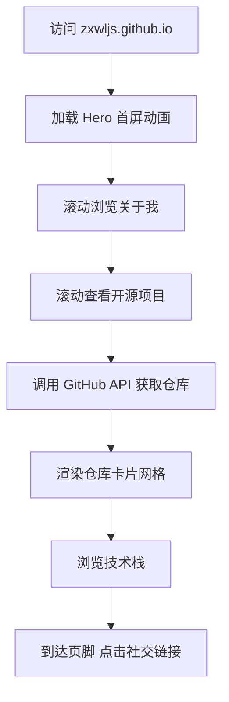

# 产品需求文档 (PRD) - zxwljs 个人主页

## 1. 产品概述

为开发者 zxwljs 打造的一款具有强烈个人风格的 GitHub Pages 个人主页。通过终端/代码美学风格，动态展示 GitHub 公开仓库信息与个人技术栈，让访客在浏览时感受到独特的工程师气质。

- 目标用户：潜在雇主、开源社区贡献者、技术爱好者
- 核心价值：以视觉化的方式展示技术能力、开源贡献与专业形象

## 2. 核心功能

### 2.1 用户角色

| 角色 | 访问方式 | 核心权限 |
|------|----------|----------|
| 访客 | 直接访问 | 浏览主页所有公开信息 |

### 2.2 功能模块

1. **Hero 首屏**：全屏展示个人标识、动态打字机效果简介、跳转到 GitHub 主页
2. **关于我**：个人简介与技术理念
3. **开源项目**：通过 GitHub API 动态获取并展示公开仓库列表
4. **技术栈**：以视觉化标签/网格形式展示技能
5. **页脚**：联系方式与社交媒体链接

### 2.3 页面详情

| 页面名称 | 模块名称 | 功能描述 |
|----------|----------|----------|
| 首页 | Hero 首屏 | 全屏暗色背景，大标题 "zxwljs"，副标题打字机效果，CTA 按钮 |
| 首页 | 关于我 | 简短个人介绍卡片，配有头像占位区 |
| 首页 | 开源项目 | 网格布局展示 GitHub 仓库卡片，含星标数、语言、描述 |
| 首页 | 技术栈 | 彩色标签/图标网格展示技术能力 |
| 首页 | 页脚 | 简洁的版权信息与社交链接 |

## 3. 核心流程

访客访问 `zxwljs.github.io` → 加载 Hero 首屏动画 → 向下滚动浏览关于我 → 继续滚动查看开源项目（自动调用 GitHub API 获取数据）→ 浏览技术栈 → 到达页脚可点击社交链接。

## 4. 用户界面设计

### 4.1 设计风格

- **主题**：深色终端风格（Dark Terminal Aesthetic）
- **主色**：深灰黑背景 `#0d1117`，卡片 `#161b22`
- **强调色**：霓虹绿 `#39ff14` / 青色 `#00f0ff` 作为高亮与交互色
- **字体**：等宽字体 JetBrains Mono（代码感）+ 无衬线字体 Space Grotesk（标题）
- **按钮**：直角边框，霓虹绿边框 hover 效果，无圆角
- **布局**：单页长滚动，区块间有大间距，内容居中对齐
- **图标**：lucide-react 图标库，线性风格
- **特效**：打字机效果、光标闪烁、轻微的发光阴影

### 4.2 页面设计概述

| 页面名称 | 模块名称 | UI 元素 |
|----------|----------|---------|
| 首页 | Hero 首屏 | 全屏高度，居中布局，`#0d1117` 背景，"zxwljs" 超大标题（Space Grotesk, 64px+），副标题打字机效果（JetBrains Mono, 18px, 绿色），底部向下滚动指示器（动画箭头） |
| 首页 | 关于我 | 两栏布局（左文字右头像），卡片背景 `#161b22`，边框 `1px solid #30363d`，标题前带有 `$` 符号装饰 |
| 首页 | 开源项目 | 网格布局（3列桌面/1列移动），仓库卡片含名称、描述、语言色点、Star 数，hover 时边框变绿色并上移 |
| 首页 | 技术栈 | 标签云/网格形式，各技术标签有不同边框色，hover 发光效果 |
| 首页 | 页脚 | 极简，居中，仅版权与 GitHub 链接，上边框分隔 |

### 4.3 响应式设计

- **桌面优先**：最大内容宽度 `1200px`，居中
- **平板**：网格变为 2 列，字体适当缩小
- **移动端**：单列布局，Hero 标题缩小至 40px，增加触摸区域

### 4.4 动画与交互

- **Hero 打字机效果**：页面加载后逐字显示副标题，带有闪烁光标
- **滚动指示器**：底部箭头上下浮动动画
- **卡片 hover**：边框颜色过渡为霓虹绿，Y 轴上移 `4px`，阴影发光
- **渐入动画**：各区块进入视口时淡入上移（使用 Intersection Observer）
- **技能标签 hover**：背景色填充，发光效果
