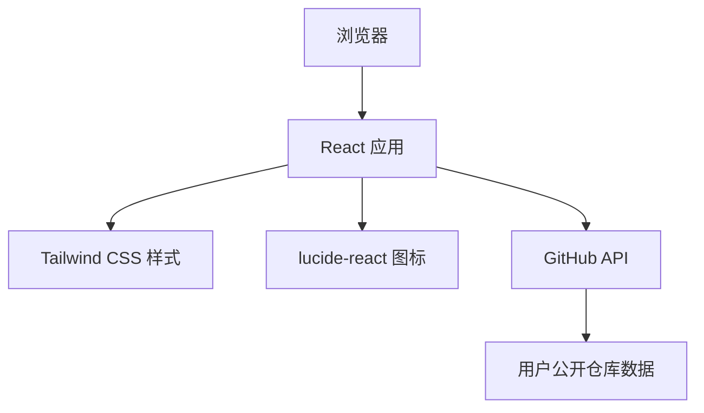

# 技术架构文档 - zxwljs 个人主页

## 1. 架构设计



纯前端静态站点架构，无后端服务，直接通过 GitHub REST API 获取公开数据。

## 2. 技术描述

- **前端框架**：React@18 + TypeScript
- **构建工具**：Vite
- **样式方案**：Tailwind CSS@3
- **图标库**：lucide-react
- **数据获取**：原生 fetch 调用 GitHub REST API
- **部署目标**：GitHub Pages

## 3. 路由定义

本项目为单页面应用，无需路由配置。

| 路由 | 用途 |
|------|------|
| / | 唯一页面，包含所有区块 |

## 4. 组件结构

| 组件名 | 职责 |
|--------|------|
| Hero | 首屏展示，打字机效果 |
| About | 个人简介 |
| Projects | GitHub 仓库展示，含 API 调用逻辑 |
| Skills | 技术栈标签网格 |
| Footer | 页脚 |
| TerminalText | 可复用的终端风格文字组件 |

## 5. 数据模型

### 5.1 GitHub API 响应模型

```typescript
interface GitHubRepo {
  id: number;
  name: string;
  description: string | null;
  html_url: string;
  stargazers_count: number;
  language: string | null;
  fork: boolean;
}
```

### 5.2 API 调用

- **端点**：`https://api.github.com/users/zxwljs/repos?sort=updated&per_page=6`
- **方法**：GET
- **说明**：获取最近更新的 6 个公开仓库，过滤掉 fork 的仓库

## 6. 项目配置要点

### 6.1 Vite 配置

- 设置 `base: '/'`（GitHub 用户页仓库直接使用根路径）

### 6.2 GitHub Pages 部署

- 构建输出目录：`dist`
- 通过 GitHub Actions 或手动推送 `dist` 内容到仓库

## 7. 依赖列表

```json
{
  "dependencies": {
    "react": "^18.2.0",
    "react-dom": "^18.2.0",
    "lucide-react": "^0.300.0"
  },
  "devDependencies": {
    "@types/react": "^18.2.0",
    "@types/react-dom": "^18.2.0",
    "@vitejs/plugin-react": "^4.0.0",
    "tailwindcss": "^3.4.0",
    "typescript": "^5.0.0",
    "vite": "^5.0.0"
  }
}
```
